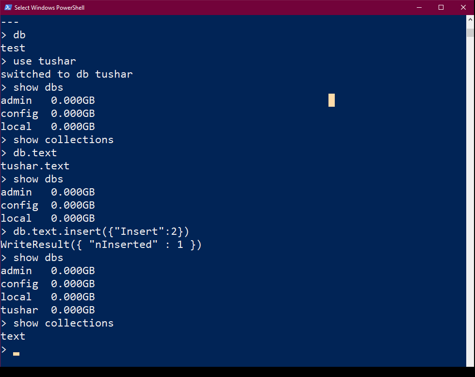

# Introduction to MongoDB
## What is MONGO DB?
<ul>
<li>No SQL Database</li>
<li>Document Oriented</li>

<li>Open-source, cross-platform,document oriented database written in C++</li>
<li>Salient Features:-</li>
<ul>
<li>Develop Faster</li>
<li>Deploy Easier</li>
<li>Scale Bigger</li></ul>
<li>MongoDb development was started in 2007</li>
<li>MongoDb 2.4.9 was the latest and stable version -released on january 10,2014.</li></ul>

## What is a Document Oriented Databse?
<ul>
<li>MongoDB stores data as documents, so it is known as document oriented database.</li>
<li>Data is stores ad BSON(like JSON)</li>
<li>If we come from RDBMS background</li><ul><li>Database == Database</li><li>Tables == Collections</li><li>Rows == Documents</li></ul>
</ul>

## Installing MONGO DB
 
<li><b>mongod</b> is the host process for the database.</li>
<li>mongo is the command-line shell that connects to a specific instance of mongod.</li>
<li>When we run mongo with no parameters it defaults to connecting to the localhost on port 27017.</li>
<li>If we run mongo against an invalid host_machine:port combination then it will fail to connect.</li>

## Basic commands of mongo

